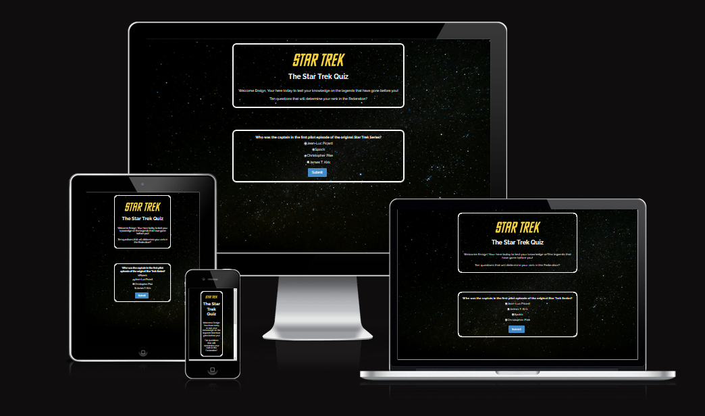
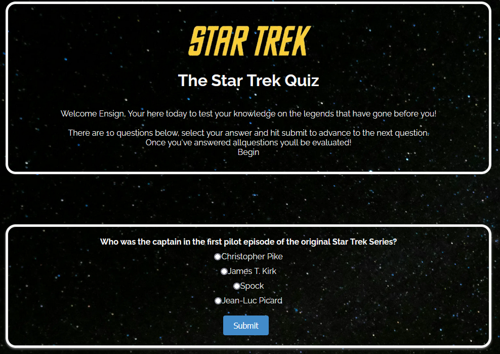
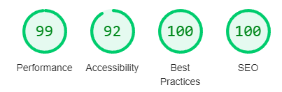
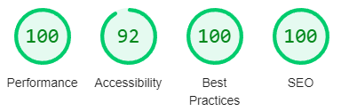
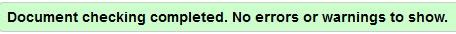

# Star Trek Quiz

The Star Trek Quiz is an interactive quiz consisting of 10 questions from the Star Trek Universe.

Users will attempt to answer as many questions as possible and at the end of the quiz will be evaluated.

You can click [here](https://d-claffey-code-institute.github.io/PP2--Star-Trek-Quiz-2/) to see the live site.

## Features

### Exsisting Features

- _Landing Page_
  - This the page the user arrives at when entering the site, it shows the rules and the start of the quiz.
  
  
    
    

- _Rules_ 
  - Informs the user how toprogress and what will happen when they have answered all the questions.

- _Retry_
  - The user is given an option to retry the quiz once they have finished.

- _Show Answers_
  - The user is given the option to see the answers to the questions they got wrong once they have finished the quiz.

- _Shuffle Answers_
  - Everytime the user starts the quiz the answers are shuffled so the user just doesn't remember the order.

### Future Features

- A leaderboard system.
- A larger variety of questions.
- Different questions depending on what series of Star Trek they select.
- A difficulty system to make the quiz more or less challenging.

## Testing

### Accessibility

- To test accessibility i used Chromes lighthouse feature in the dev tools.

  - Mobile:

  

  - Desktop:

  

### Code Validation

- For CSS validation i used WSC Jigsaw which came back with no errors: 
  - 

- For HTML validation i used WSC Markup which came back with no errors:
  - 

- For Javascript validation I used JSHint which came back with no errors.

## Deployment/Forking/Cloning

### Deployment
I used Gitpod to develop the code and then pushed to Github.

Here are the following steps I used to deploy the website from Github repository to Github Pages.

1. Log in to Github and find the repository you wish to deploy.
2. At the top of the page, click on "Settings".
3. On the left hand side of the settings page, under Code and automation, click on "Pages".
4. From the source section drop-down menu, select the Main Branch.
5. Click Save.

### Forking

1. On GitHub.com, navigate to the octocat/Spoon-Knife repository.
2. In the top-right corner of the page, click Fork.
3. Under "Owner," select the dropdown menu and click an owner for the forked repository.
4. By default, forks are named the same as their upstream repositories. Optionally, to further distinguish your fork, in the "Repository name" field, type a name.
5. Optionally, in the "Description" field, type a description of your fork.
6. Optionally, select Copy the DEFAULT branch only. For many forking scenarios, such as contributing to open-source projects,
 you only need to copy the default branch. If you do not select this optionl all branches will be copied into the new fork.
7. Click Create fork.

### Cloning

1. On GitHub.com, navigate to the main page of the repository.
2. Above the list of files, click "Code".
3. Copy the URL for the repository.
  - To clone the repository using HTTPS, under "HTTPS", click .
  - To clone the repository using an SSH key, including a certificate issued by your organization's SSH certificate authority, click SSH, then click.
  -To clone a repository using GitHub CLI, click GitHub CLI, then click.
4. Open Git Bash.
5. Change the current working directory to the location where you want the cloned directory.
6. Type git clone, and then paste the URL you copied earlier. _git clone https://github.com/YOUR-USERNAME/YOUR-REPOSITORY_
7. Press Enter to create your local clone.

