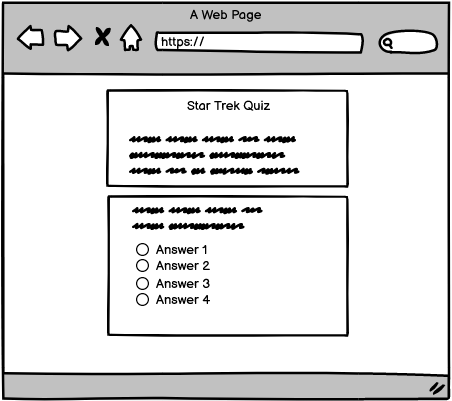
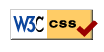

# Star Trek Quiz

The Star Trek Quiz is an interactive quiz consisting of 10 questions from the Star Trek Universe.

Users will attempt to answer as many questions as possible and at the end of the quiz will be evaluated.

You can click [here](https://d-claffey-code-institute.github.io/PP2--Star-Trek-Quiz-2/) to see the live site.

## Table of Content

#### [Features](#features)
#### [User Experiance](#user-experience)
#### [Technologies](#technologies-used)
#### [Testing](#testing)
#### [Deployment/Forking/Cloning](#deploymentforkingcloning)
#### [Content](#content)
___

## Features

### Exsisting Features

- _Landing Page_
  - This the page the user arrives at when entering the site, it shows the rules and the start of the quiz.
  
  
    
    

- Rules 
  - Informs the user how toprogress and what will happen when they have answered all the questions.

- Retry
  - The user is given an option to retry the quiz once they have finished.

- Show Answers
  - The user is given the option to see the answers to the questions they got wrong once they have finished the quiz.

- Shuffle Answers
  - Everytime the user starts the quiz the answers are shuffled so the user just doesn't remember the order.

### Future Features

- A leaderboard system.
- A larger variety of questions.
- Different questions depending on what series of Star Trek they select.
- A difficulty system to make the quiz more or less challenging.

___
## User Experience

The quiz is of a simple design consisting of 10 questions. At the end of the quiz the user will get a rank depending on their score. They can then retry the quiz if they like. 

### User Stories
As a user:
- I want the site to be simple and easy to navigate
- I want to be able to test my knowledge of the Star Trek universe.
- I want to be able to easily find the site in search engines.

### As a Developer:
As a developer:
- I want the user to easily navigate the site.
- I want the user to be challenged.
- I want the user to try again to achieve a higher rank.

### Color Scheme
The site consists of a background showing a picture of space. So I used text and bordering with the colour "Whitesmoke".

This was to have a clear contrast between the background and content, it also lets the content of the site take center stage.

### Typography
The font used is easy to read and clear against the dark background.

For the font I used the Google font, Raleway.

Here is the link https://fonts.google.com/specimen/Raleway

### Wire frames

Wire Frames are made using Balsamiq and shown here.

___
## Technologies used

### Languages

<li>HTML</li>
<li>CSS</li>
<li>Javascript</li>

### Frameworks, Libraries and Programs

#### Google Fonts
- I imported Google fonts and placed it in the style tag in the HTML file.
#### Favicon
- For my Favicon, I used a Star Trek favicon from https://freefavicon.com/freefavicons/objects/iconinfo/star-trek-badge-152-203991.html
#### Github
- I used Github to store my project and to deploy it.
#### Am I Responsive
- I used the Am I responsive website to give a screenshot of how my site looks on various screen sizes. 
#### Balsamiq
- I used Balsamiq to create the wireframe for my project.
___
## Testing

### Accessibility

- To test accessibility i used Chromes lighthouse feature in the dev tools.

  - Mobile:

  

  - Desktop:

  

### Code Validation

- For CSS validation i used WSC Jigsaw which came back with no errors: 
  - 

- For HTML validation i used WSC Markup which came back with no errors:
  - 

- For Javascript validation I used JSHint which came back with no errors.

___
## Deployment/Forking/Cloning

### Deployment
I used Gitpod to develop the code and then pushed to Github.

Here are the following steps I used to deploy the website from Github repository to Github Pages.

1. Log in to Github and find the repository you wish to deploy.
2. At the top of the page, click on "Settings".
3. On the left hand side of the settings page, under Code and automation, click on "Pages".
4. From the source section drop-down menu, select the Main Branch.
5. Click Save.

### Forking

1. On GitHub.com, navigate to the octocat/Spoon-Knife repository.
2. In the top-right corner of the page, click Fork.
3. Under "Owner," select the dropdown menu and click an owner for the forked repository.
4. By default, forks are named the same as their upstream repositories. Optionally, to further distinguish your fork, in the "Repository name" field, type a name.
5. Optionally, in the "Description" field, type a description of your fork.
6. Optionally, select Copy the DEFAULT branch only. For many forking scenarios, such as contributing to open-source projects,
 you only need to copy the default branch. If you do not select this optionl all branches will be copied into the new fork.
7. Click Create fork.

### Cloning

1. On GitHub.com, navigate to the main page of the repository.
2. Above the list of files, click "Code".
3. Copy the URL for the repository.
  - To clone the repository using HTTPS, under "HTTPS", click .
  - To clone the repository using an SSH key, including a certificate issued by your organization's SSH certificate authority, click SSH, then click.
  -To clone a repository using GitHub CLI, click GitHub CLI, then click.
4. Open Git Bash.
5. Change the current working directory to the location where you want the cloned directory.
6. Type git clone, and then paste the URL you copied earlier. _git clone https://github.com/YOUR-USERNAME/YOUR-REPOSITORY_
7. Press Enter to create your local clone.

___
## Content
- The wireframe was created using [Balsamiq](https://balsamiq.com/)

- The Questions for the game were taken from https://www.chipublib.org/blogs/post/quiz-how-well-do-you-know-star-trek/

- Quiz tutorial code from https://www.codewithfaraz.com/content/161/build-a-quiz-application-with-html-css-and-javascript-step-by-step-guide

- Font from [Google Fonts](https://fonts.google.com/)

- Favicon from [Free Favicon](https://freefavicon.com/freefavicons/objects/iconinfo/star-trek-badge-152-203991.html)

- site to remove the background from the Star Treklogo was  [Remove.bg](https://remove.bg/)
